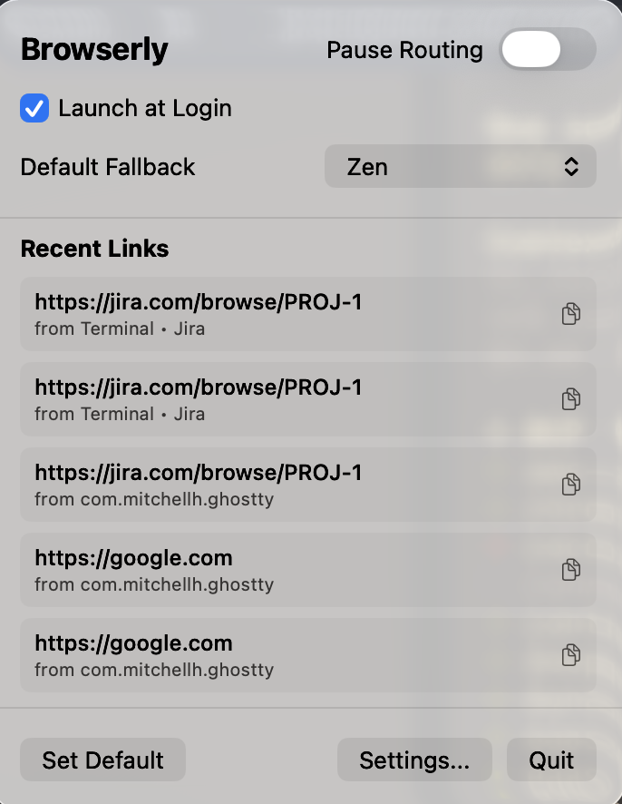

# Browserly

A smart macOS menu bar app that routes URLs to the right browser based on custom rules.

<p align="center">
  
</p>

## Features

- **Domain rules** — route `github.com` to Chrome, `twitter.com` to Safari
- **Regex rules** — match any part of a URL with regular expressions
- **Source app rules** — route based on which app opened the link (e.g. Slack → Work Chrome)
- **Browser profiles** — target specific Chrome/Edge/Brave profiles
- **Incognito mode** — open matched URLs in private windows
- **Menu bar app** — lives in the menu bar, no Dock icon

## Install

Download the latest DMG from [GitHub Releases](../../releases), open it, and drag Browserly to your Applications folder.

Or [build from source](#building-from-source).

## Usage

1. Open Browserly — it appears in your menu bar.
2. Click the menu bar icon and press **Set Default** to register as your system's default browser.
3. Check the **Launch at Login** box to automatically start Browserly when you turn on your Mac.
4. Edit your [configuration](#configuration) to define routing rules.
5. All intercepted URLs are now routed based on your rules.

### Try without changing your default browser

Pass a URL directly to test routing without any system registration:

```bash
swift run Browserly "https://github.com"
```

The app processes the URL, opens the matched browser, and stays in the menu bar.

## Configuration

Config file location:

```
~/Library/Application Support/Browserly/config.json
```

### Rule types

| Type | Matches against | Example pattern |
|---|---|---|
| `domain` | URL hostname | `github.com` |
| `regex` | Full URL | `.*[?&]debug=true.*` |
| `sourceApp` | Sending app's bundle ID | `com.tinyspeck.slackmacgap` |

### Browser options

| Field | Description |
|---|---|
| `profileDirectory` | Target a specific Chromium profile folder (e.g. `Profile 1`) |
| `isIncognito` | Set `true` to open in a private/incognito window |

<details>
<summary>Full configuration example</summary>

```json
{
  "defaultBrowserId": "com-apple-safari",
  "browsers": [
    {
      "id": "com-apple-safari",
      "name": "Safari",
      "bundleId": "com.apple.Safari",
      "isIncognito": false
    },
    {
      "id": "google-chrome",
      "name": "Chrome",
      "bundleId": "com.google.Chrome",
      "isIncognito": false
    },
    {
      "id": "chrome-work",
      "name": "Chrome (Work Profile)",
      "bundleId": "com.google.Chrome",
      "profileDirectory": "Profile 1",
      "isIncognito": false
    }
  ],
  "rules": [
    {
      "id": "550e8400-e29b-41d4-a716-446655440000",
      "name": "Work Domain",
      "type": "domain",
      "pattern": "github.com",
      "targetBrowserId": "chrome-work"
    },
    {
      "id": "6ba7b810-9dad-11d1-80b4-00c04fd430c8",
      "name": "Social Media (Regex)",
      "type": "regex",
      "pattern": ".*(twitter|facebook|instagram)\\.com",
      "targetBrowserId": "com-apple-safari"
    },
    {
      "id": "7da7b810-9dad-11d1-80b4-00c04fd430c9",
      "name": "Slack Links",
      "type": "sourceApp",
      "pattern": "com.tinyspeck.slackmacgap",
      "targetBrowserId": "chrome-work"
    }
  ]
}
```

</details>

## Building from Source

Requires Swift 5.9+ and macOS 14 (Sonoma) or later.

```bash
swift build                      # debug build
swift build -c release           # release build
swift Tests/Validate.swift       # standalone routing validation (no Xcode needed)
swift test                       # full test suite (requires Xcode)
```
