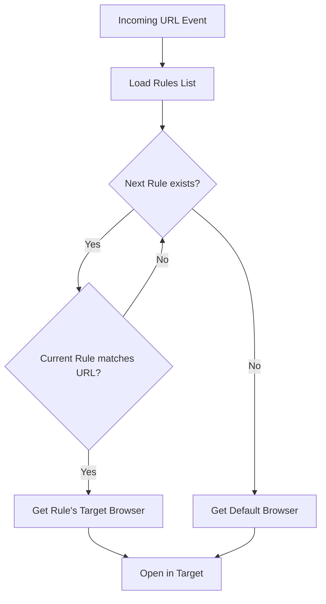

# Feature Specification: URL Routing Engine

**Feature Branch**: `002-routing-engine`  
**Created**: 2026-05-28  
**Status**: Draft  
**Input**: User description: "# ЗАПРОС: Спецификация логики маршрутизации (Routing Engine Spec) Контекст: Приложение распределяет входящие ссылки между «Рабочим» и «Личным» контекстами (браузерами). Задача: Создать детальную спецификацию для движка фильтрации URL. Требования к спецификации: 1. Модель данных (Data Structures): Описать структуру Rule (Правило) и TargetBrowser (Целевой браузер/профиль). 2. Алгоритм матчинга (Matching Pipeline): Входящая ссылка типа String должна проходить через цепочку проверок: - Проверка по домену (строгое совпадение). - Проверка по маске / регулярному выражению (Regex). - Проверка по источнику (какое приложение открыло ссылку — например, Slack или Telegram), используя NSWorkspace.shared.frontmostApplication. 3. Концепция Default/Fallback: Если ни одно правило не подошло, ссылка уходит в «Личный браузер». 4. Архитектура парсера: Описать, как правила будут храниться (JSON/YAML в Application Support) и как движок будет валидировать их структуру при запуске. Выходной формат: Functional & Technical Spec (Функциональная спецификация) с блок-схемой алгоритма в текстовом виде (Mermaid.js)."

## Clarifications

### Session 2026-05-28
- Q: Should the engine follow a strict user-defined sequence or a fixed hierarchy? → A: Strict user-defined sequence (First match in list wins).

## User Scenarios & Testing *(mandatory)*

### User Story 1 - Work Link Redirection (Priority: P1)

As a user, when I click a link to a known work domain (e.g., `github.com`), I want it to open in my "Work" browser automatically.

**Why this priority**: Core functionality of the app.
**Independent Test**: Configure a rule for `github.com` to point to "Work". Click a GitHub link in an external app. Verify "Work" browser opens.

**Acceptance Scenarios**:
1. **Given** a rule exists for `github.com` mapping to "Work", **When** a link `https://github.com/my-org` is clicked, **Then** the link opens in the "Work" browser.

---

### User Story 2 - Application Source Matching (Priority: P2)

As a user, when I click any link inside Slack, I want it to open in my "Work" browser regardless of the domain, because Slack is a work tool.

**Why this priority**: Enhances the automation by using context (source app).
**Independent Test**: Configure a rule for "Slack" to point to "Work". Click a random link (e.g., `google.com`) inside Slack. Verify "Work" browser opens.

**Acceptance Scenarios**:
1. **Given** a rule exists for source application "Slack" mapping to "Work", **When** any link is clicked within Slack, **Then** the link opens in the "Work" browser.

---

### User Story 3 - Default Browser Fallback (Priority: P1)

As a user, when I click a link that doesn't match any of my rules, I want it to open in my "Personal" browser so that my private browsing stays separated.

**Why this priority**: Ensures all links are handled safely even without specific rules.
**Independent Test**: Clear all rules. Click any link. Verify "Personal" browser opens.

**Acceptance Scenarios**:
- Q: Should each rule have a mandatory unique identifier (ID) and an optional "Title/Name"? → A: Both mandatory ID and optional Name.
- Q: If the configuration file is corrupted on startup, how should the app behave? → A: Block startup and show error dialog.

## User Scenarios & Testing *(mandatory)*
...
### Edge Cases

- **Conflicting Rules**: What if a link matches both a domain rule and an application source rule? (Assumption: Rule precedence follows list order).
- **Invalid Regex**: How does the system handle a malformed regular expression in a rule? (Assumption: Skip the rule and log an error).
- **Corrupt Configuration**: If the configuration file is unreadable or fails schema validation, the system MUST block launch and inform the user.
- **Missing Application Support Directory**: How does the system handle first-launch where configuration doesn't exist? (Assumption: Create default configuration).

## Requirements *(mandatory)*

### Functional Requirements

- **FR-001**: The system MUST store and load a list of "Rules" and "Target Browsers" from a persistent configuration file.
- **FR-002**: Each "Rule" MUST support matching based on strict domain equality.
- **FR-003**: Each "Rule" MUST support matching based on regular expression patterns.
- **FR-004**: Each "Rule" MUST support matching based on the source application that triggered the URL open event.
- **FR-005**: The system MUST validate the configuration structure on startup; if the file is corrupted or invalid, it MUST block application launch and display an error message to the user.
- **FR-006**: The system MUST implement a sequential matching pipeline where rules are evaluated in the exact order they appear in the configuration; the first matching rule immediately determines the target.
- **FR-007**: The system MUST support a "Default/Fallback" browser definition for unmatched URLs.

### Matching Pipeline (Algorithm)

### Key Entities

- **Rule**: Defines a criteria (Domain, Regex, or Source App) and a corresponding `TargetBrowser`. MUST have a unique `id` (e.g., UUID) and SHOULD have a descriptive `name`.
- **TargetBrowser**: Represents a specific browser application or profile installed on the system (e.g., "Chrome - Work Profile", "Safari").
- **Configuration**: The collection of all Rules and the designated Default Browser.

## Success Criteria *(mandatory)*

### Measurable Outcomes

- **SC-001**: The routing decision is made in under 5ms after the URL is captured.
- **SC-002**: 100% of links matching defined rules are routed to the correct target.
- **SC-003**: The configuration file is successfully validated in under 50ms during application startup.

## Assumptions

- **Persistence**: Configuration is stored in `Application Support` as JSON or YAML for easy editing.
- **Precedence**: Rule precedence is determined strictly by the order in the configuration file.
- **Validation**: Rules with invalid target browsers will result in falling back to the default browser.
- **OS Context**: The system can reliably identify the "frontmost application" at the time a link is clicked to determine the source.
tion" at the time a link is clicked to determine the source.
